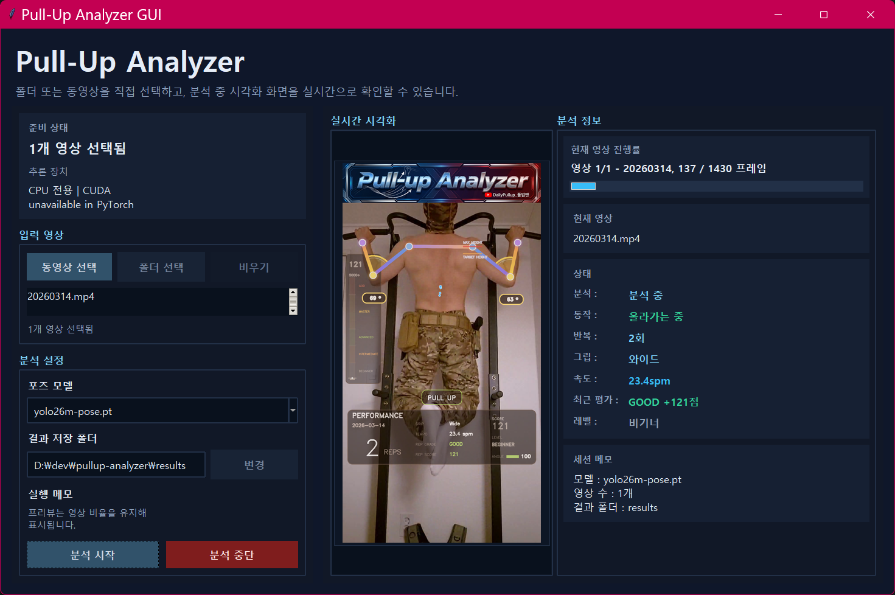

# pullup-analyzer

<p align="center">
  풀업 영상을 자동으로 분석해서 <b>반복 횟수</b>, <b>상태</b>, <b>각도</b>, <b>점수</b>, <b>레벨</b>이 포함된 결과 영상을 생성합니다.
</p>

<p align="center">
  
</p>

<p align="center">
  <a href="resource/demo.mp4">고화질 데모 영상 보기</a>
  ·
  <a href="SCORING.md">점수 기준 보기</a>
</p>

<p align="center">
  <a href="https://www.youtube.com/@DailyPullUp_%ED%92%80%EC%97%85%EB%A7%A8/shorts">
    
  </a>
</p>

<p align="center">
  유튜브 채널 <b>Dailypullup_풀업맨</b>에서 Shorts 기반 데모와 풀업 기록도 함께 확인할 수 있습니다.
</p>

## 풀업 점수 평가방식

### 레벨 구간

| 구간 | 레벨 | 설명 |
| --- | --- | --- |
| `0~999` | 비기너 | 기본 체력 형성 구간 |
| `1000~1999` | 중급자 | 안정적인 누적 수행 구간 |
| `2000~2999` | 고급자 | 높은 품질의 반복 누적 구간 |
| `3000~4999` | 마스터 | 상위권 수행 누적 구간 |
| `5000+` | 신 | 최상위 수행 구간 |

### 1회 점수 구성

| 항목 | 반영 | 기준 |
| --- | --- | --- |
| 기본 점수 | `+90점` | rep 1회 인정 |
| 중심 안정성 | `-0~5점` | 좌우 흔들림이 클수록 감점 |
| 높이 | `-10~+10점` | 기준 미달 감점, 기준 이상 가점 |
| 각도 | `-10~+10점` | 기준 미달 감점, 깊게 수축하면 가점 |
| 데드행 | `+10점` | 완전 신전 시작 |
| 탑홀딩 | `+0~50점` | 높이+각도 충족 시 `0.1초당 5점`, 최대 `1초` |
| 최종 점수 | `0점 이상` | 좋은 자세면 `100점 초과` 가능 |

## 주요 기능

- `.mp4` 풀업 영상을 자동 분석
- YOLO pose 모델 기반 사람 자세 추정
- `app.py` GUI에서 개별 동영상 또는 폴더를 직접 선택해 분석
- GUI에서 실시간 시각화, 상태 패널, 진행률 확인
- 풀업 반복 횟수 자동 카운트
- `PULL UP`, `PULL DOWN`, `DEAD HANG` 상태 시각화
- 팔 각도, 스켈레톤, 최고 높이, 기준 높이 오버레이
- 회차별 획득 점수와 누적 점수 계산
- 레벨 구간 표시
- `console.py` 배치 실행과 진행률 표시 지원
- 결과 영상 저장 후 원본 오디오 재병합

## 다운로드

Windows x64 실행 파일:

- [PullUpAnalyzer-win-x64-v1.2.0.zip](https://github.com/HeungJunKim/pullup-analyzer/releases/download/v1.2.0/PullUpAnalyzer-win-x64-v1.2.0.zip)

안내:

- Python 설치 없이 바로 실행할 수 있습니다.
- CPU 전용 데스크톱 빌드입니다.
- 첫 실행 시 포즈 모델은 `%LOCALAPPDATA%\PullUpAnalyzer\models` 경로로 자동 다운로드됩니다.
- 결과 파일은 기본적으로 `%LOCALAPPDATA%\PullUpAnalyzer\results` 아래에 저장되며, GUI에서 다른 폴더로 변경할 수 있습니다.

## 설치

### 권장 환경

- Python `3.10+`
- `ffmpeg`, `ffprobe`
- Linux 또는 WSL 환경 권장
- CUDA가 가능하면 `GPU 0` 우선 사용, 실패 시 자동으로 CPU 전환

### Python 패키지 설치

```bash
python3 -m venv .venv
source .venv/bin/activate
pip install --upgrade pip
pip install -r requirements.txt
```

### 시스템 패키지 설치

결과 영상 저장과 오디오 병합은 `ffmpeg/ffprobe` 기준으로 동작합니다.

Ubuntu / Debian 예시:

```bash
sudo apt update
sudo apt install -y ffmpeg
```

## 실행 방법

콘솔 실행:

```bash
python console.py
```

GUI 실행:

```bash
python app.py
```

GUI에서는 영상 선택, 결과 폴더 설정, 모델 선택, 실시간 시각화 확인이 가능합니다.

지원 포즈 모델: `yolo26s-pose.pt`, `yolo26m-pose.pt`, `yolo26l-pose.pt`, `yolo26x-pose.pt`

## 폴더 구조

```text
pullup-analyzer/
├── app.py
├── console.py
├── requirements.txt
├── LICENSE
├── README.md
├── SCORING.md
├── pullup_analyzer/
│   ├── __init__.py
│   ├── analyzer.py
│   ├── console.py
│   ├── rendering.py
│   └── state.py
├── models/
├── videos/
├── results/
└── resource/
```

폴더 용도:

- `models/`: YOLO pose 모델 파일 보관
- `videos/`: 입력 영상 보관
- `results/`: 분석 결과 영상 저장
- `resource/`: 타이틀 이미지, GUI 캡처(`app.png`), 데모 영상 보관

## 점수 체계

이 프로젝트는 단순 반복 횟수만 세지 않고, 자세 품질까지 반영해서 `누적 Score`를 계산합니다.

- 회차별 점수 누적
- 높이, 각도, 중심 안정성, 데드행, 탑홀딩 반영
- 좋은 자세일수록 같은 1회라도 더 높은 점수 획득

자세한 기준은 아래 문서를 참고하세요.

- [SCORING.md](SCORING.md)

## 저장 방식

- 결과 영상은 고화질 `H.264` 기반으로 저장됩니다.
- 원본 영상에 오디오가 있으면 마지막에 다시 붙입니다.
- 마지막 프레임은 최종 점수와 레벨을 확인할 수 있도록 몇 초간 유지됩니다.

## 참고 사항

- `console.py`는 `videos/` 폴더의 `.mp4` 파일을 순서대로 처리합니다.
- `app.py`는 데스크톱 GUI로 개별 동영상 또는 폴더를 직접 선택해서 실시간 시각화와 함께 분석할 수 있습니다.
- 결과 파일명은 기본적으로 `<원본파일명>_result.mp4` 형식입니다.
- 콘솔은 스크롤이 과하게 밀리지 않도록 진행률 바와 상태줄 중심으로 출력합니다.
- README 상단 이미지는 `resource/app.png`, 타이틀 이미지는 `resource/tilte.png`를 사용합니다.

## 레퍼런스

- Ultralytics Pose Task Docs: https://docs.ultralytics.com/tasks/pose/
- Ultralytics GitHub: https://github.com/ultralytics/ultralytics

